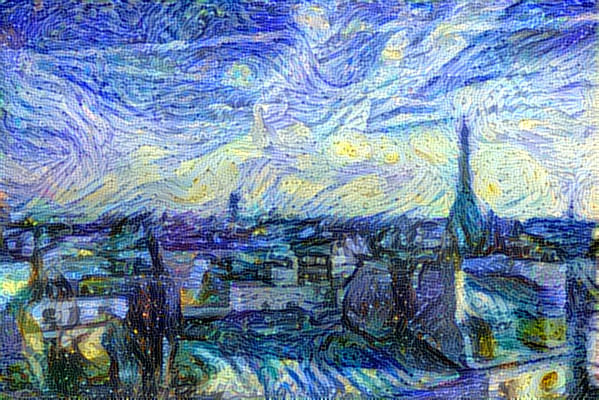
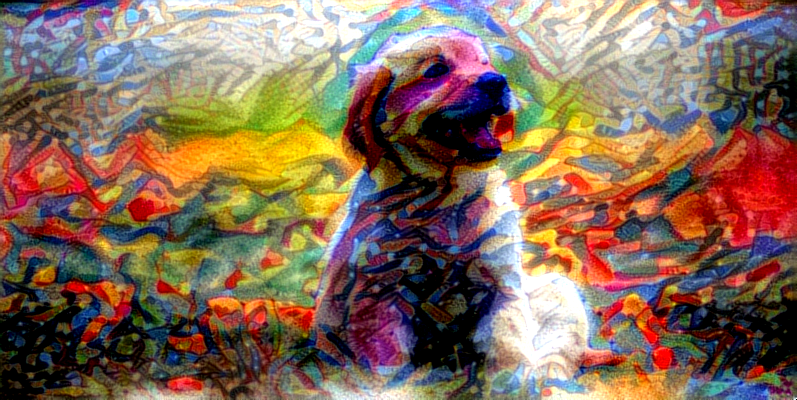

# IANNwTF Project - Group 28 & 24
**Project for IANNwTF Course WiSe 21/22 Cognitive Science at University Osnabrück**

<!-- ABOUT THE PROJECT -->
## About The Project



This project is part of the _'Introduction to Artificial Neural Networks with Tensorflow'_ course at the _University Osnabrück_.  
In our project we generate pictures to which the art style of a chosen artist is transmitted while keeping the pictures content complete.  
For this we implemented 2 different approaches, on the one hand CycleGAN ( [Link to the CycleGAN Paper](https://arxiv.org/pdf/1703.10593.pdf) ) and on the other hand Neural Style Transfer ( [Link to the Neural Style Transfer Paper](https://arxiv.org/pdf/1508.06576.pdf) ), with the use of TensorFlow.
<p align="right">(<a href="#top">back to top</a>)</p>

<!-- Project Structure -->
## Project Structure

    .
    ├── images 
    ├── src                    
    │   ├──── Configs                               # Here you can find all the configs          
    │   │     ├── Config.py
    │   │     ├── ConfigCycleGAN.py
    │   │     └── ConfigNeuralStyleTransfer.py
    │   │
    │   ├──── Data                                  # Here you can find downloaded/unpacked Datasets and Data Utilities
    │   │     ├── Downloads
    │   │     ├── DataPipeline.py
    │   │     ├── DatasetDownloader.py
    │   │     └── Data_Utilities.py
    │   │
    │   ├──── Logs                                  # Here you can find generated images and Tensorboard Logs
    │   │
    │   ├──── Models                                # Here you can find all used Models
    │   │     ├── BaseModel.py
    │   │     ├── CycleGAN.py
    │   │     ├── NeuralStyleTransfer.py
    │   │     └── PatchGAN.py
    │   │
    │   ├──── Utilities                             # Here you can find general Utilities
    │   │     ├── Callbacks                         # Here you can find custom Callbacks
    │   │     └── Visualizer
    │   │
    │   ├──── wandb
    │   ├─ main_CycleGAN.py                         # Run this main for CycleGAN
    │   └─ main_NeuralStyleTransfer.py              # Run this main for NeuralStyleTransfer
    │
    │── .gitignore
    │── LICENSE
    │── main_all_colab.ipynb
    │── main_CycleGAN_colab.ipynb
    │── main_NeuralStyleTransfer_colab.ipynb
    │── README.md
    └── requirements.txt


<p align="right">(<a href="#top">back to top</a>)</p>

<!-- GETTING STARTED -->
## Getting Started

## Neural Style Transfer Example 1:

### Reference:


Dog before Style Transfer | Dog after Style Transfer
:-------------------------:|:-------------------------:
 | 


## Neural Style Transfer Example 2:

### Reference:


Paris before Style Transfer | Paris after Style Transfer
:-------------------------:|:-------------------------:
 | 


### Prerequisites

The only thing you need to do, is to install all the requirements that are listed in requirements.txt. 
Feel free to use following command inside "IANNwTF" Project.

  ```
  pip install -r requirements.txt
  ```

In this Project "Weights & Biases"(short wandb) is utilized. You can disable it in src/Configs/Config_(CycleGAN | NeuralStyleTransfer) under _config>settings>use_wandb_. 

Otherwise you need to create a [wandb account](https://wandb.ai/site) and get your API Key. I can fully recommend it! Besides that we have also included the option to use Tensorboard.


<p align="right">(<a href="#top">back to top</a>)</p>

### Colab Version

Alternatively you can use the provided Jupyter Notebooks main_*_colab.ipynb to instantly start using our project, without any hassle.

Feel also free to use this Online Colab Version: [Colab Link](https://colab.research.google.com/drive/14iAIuzIXH6-_RZqMOxDhV-ac96UYbm9O?usp=sharing)


<p align="right">(<a href="#top">back to top</a>)</p>

<!-- USAGE EXAMPLES -->
### Usage
Run `main_(CycleGAN | NeuralStyleTransfer).py` with _"IANNwTF/src/"_ as Working Directory.

You can change the most important settings and hyperparameters in the Configs section.

<p align="right">(<a href="#top">back to top</a>)</p>

<!-- AUTHORS -->
## Authors
* Erik Bossow
* Julia Fülling
* Lena Kagoshima
* Peter Keffer
* Linda Ariel Ventura di Lorenzo Lopes
* Jan-Eric Wiemann


<p align="right">(<a href="#top">back to top</a>)</p>


<!-- ACKNOWLEDGMENTS -->
## Acknowledgments

Extensively used resources besides Original-Papers:

https://keras.io/examples/generative/neural_style_transfer/
https://machinelearningmastery.com/cyclegan-tutorial-with-keras/


Tools:

https://wandb.ai/site

<p align="right">(<a href="#top">back to top</a>)</p>

